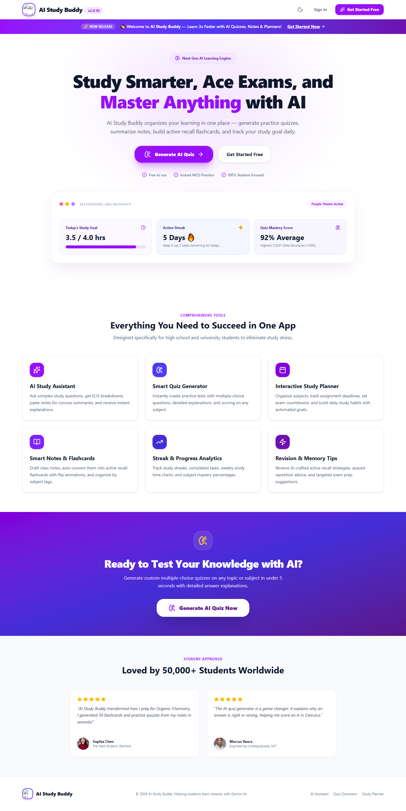
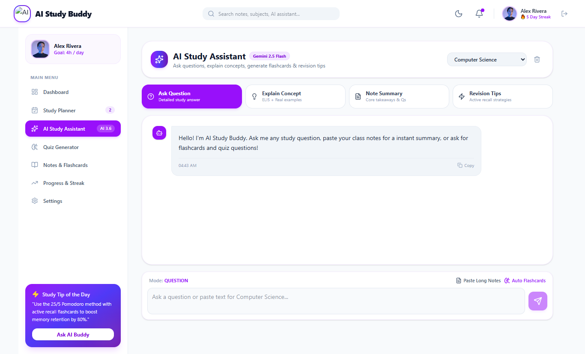
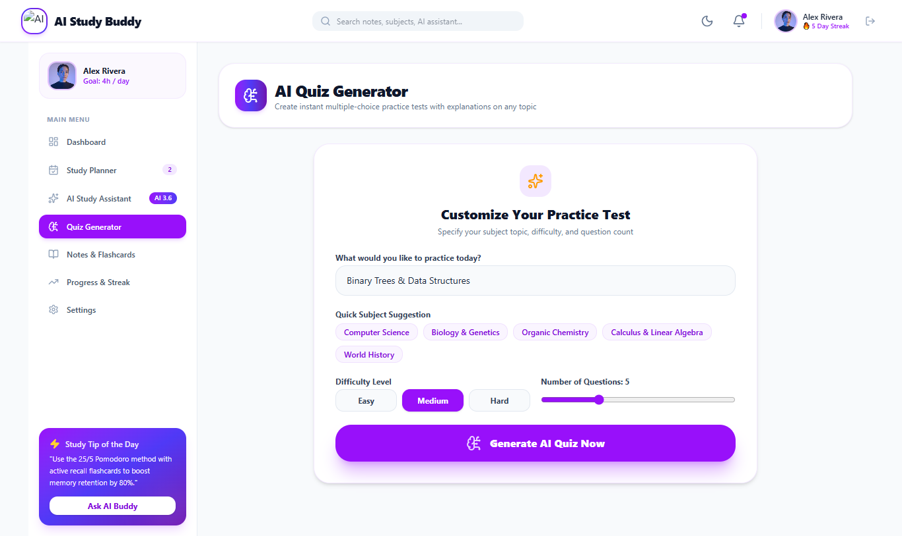
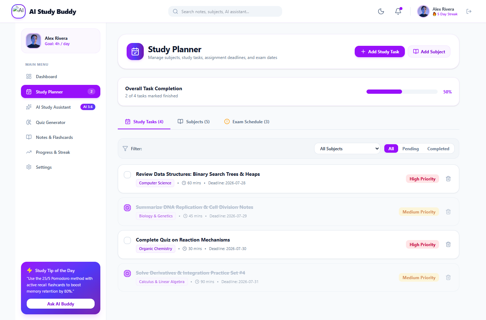
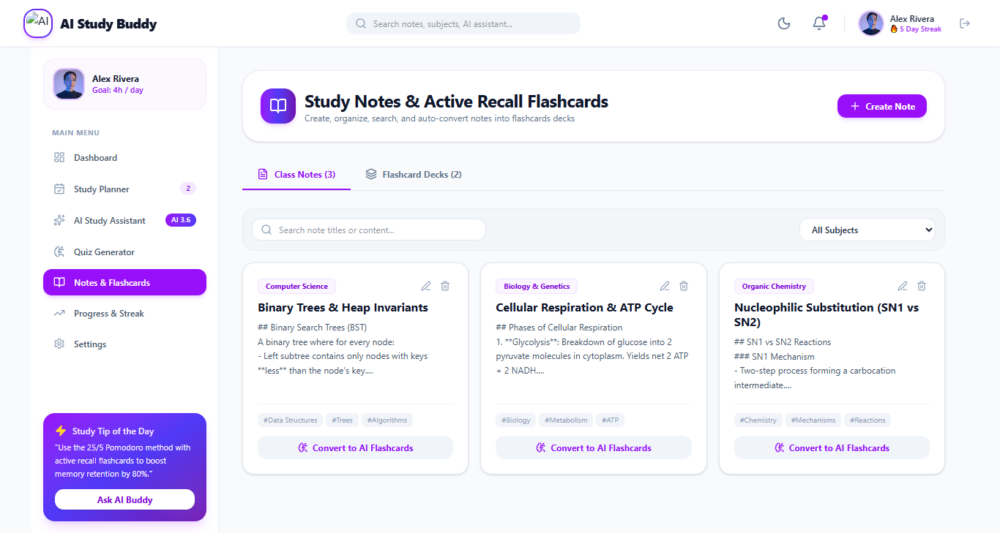

# 🎓 AI Study Buddy

> Your intelligent AI-powered learning companion that helps students study smarter, practice effectively, and stay organized.

## 🚀 Live URL

🔗 https://ai-study-buddy-ininn1d2w-barrerasohail62-3330s-projects.vercel.app/

---

## 📖 Project Overview

AI Study Buddy is an AI-powered web application designed to make learning easier, faster, and more personalized. It helps students understand difficult topics, generate quizzes, create flashcards, plan study schedules, and monitor their learning progress—all in one place.

---

## ✨ Features

### 🤖 AI Study Assistant
- Ask questions on any subject.
- Receive clear, AI-generated explanations.
- Get personalized learning support.

### 📝 AI Quiz Generator
- Generate quizzes from any topic.
- Practice with multiple-choice questions.
- Improve understanding through instant feedback.

### 📅 Smart Study Planner & Exam Tracker
- Create personalized study plans.
- Organize daily study tasks.
- Track exams and deadlines.

### 📚 Notes & One-Click Flashcards
- Save important notes.
- Convert notes into flashcards instantly.
- Revise faster with active recall.

### 📊 Analytics & Mastery Dashboard
- Track your learning progress.
- View quiz performance.
- Identify strengths and areas for improvement.

---

## 📸 Screenshots

### 🏠 Home Page


### 🤖 AI Study Assistant



### 📝 AI Quiz Generator



### 📅 Study Planner


### Notes and Flashcards

---

## 🛠️ Tech Stack

**Frontend**
- React 19
- TypeScript
- Tailwind CSS v4
- Motion
- Recharts

**Backend**
- Express.js

**AI**
- Google Gemini 2.5 Flash API

**Build Tools**
- Vite

**Deployment**
- Vercel

---

## 📁 Project Structure

```
AI-Study-Buddy
│
├── components
├── pages
├── hooks
├── services
├── server
├── public
├── assets
├── README.md
└── package.json
```

---

## ⚙️ Installation

Clone the repository

```bash
git clone <your-github-repository-link>
```

Install dependencies

```bash
npm install
```

Create a `.env` file and add:

```env
GEMINI_API_KEY=YOUR_API_KEY
```

Run the project

```bash
npm run dev
```

---

## 🚀 Deployment

This application is deployed on **Vercel**.

To deploy:

- Push your code to GitHub.
- Import the repository into Vercel.
- Add the required environment variables.
- Deploy the application.

---

## 💡 Challenges Faced

- Integrating the Gemini API.
- Designing a responsive interface.
- Managing application state.
- Deploying successfully on Vercel.

---

## 🔮 Future Improvements

- User authentication
- Cloud synchronization
- Dark mode
- Voice-based AI assistant
- PDF upload and AI summarization
- Progress reminders and notifications

---

## 🎯 Why I Built This Project

Students often use multiple apps for studying, note-taking, quizzes, and planning. AI Study Buddy brings these features together into a single AI-powered platform to make learning more efficient and engaging.

---

## 🙏 Acknowledgements

Special thanks to:

- Google AI Studio
- Google Gemini API
- React
- Tailwind CSS
- Vercel

---

## 👨‍💻 Author

**Barrera Sohail**

Final AI Application Project

---

## 📄 License

This project is developed for educational purposes.
